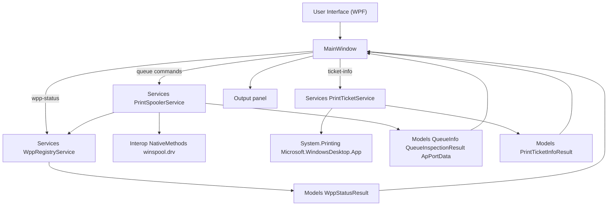
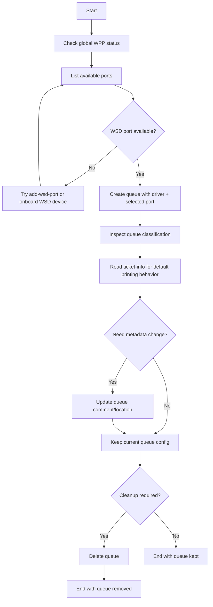
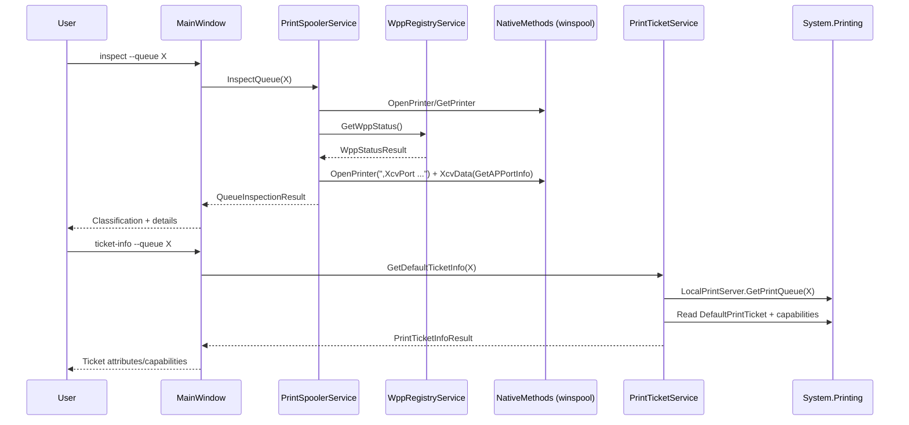
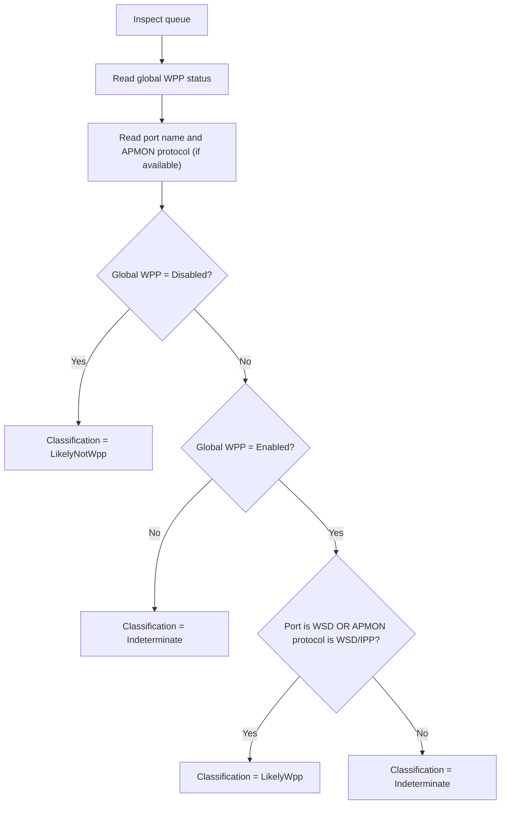

# Architecture Styles for Study

## Why this structure exists
This POC is intentionally organized to show complementary styles in the same project:

1. **Modern managed application style (WPF front-end)**
   - `WppQueuePoc.App/MainWindow.xaml(.cs)`: UI actions, validation, async execution, output rendering.
   - `Abstractions/*`: interfaces for service contracts.
   - `Models/*`: immutable records/enums for clean data flow.

2. **Native interop style (Windows Print Spooler)**
   - `Interop/NativeMethods.cs`: raw P/Invoke bindings, structs, constants.
   - `Services/PrintSpoolerService.cs`: safe wrapper around native calls (`OpenPrinter`, `XcvData`, `AddPrinter`, `SetPrinter`, `DeletePrinter`, `EnumPorts`, `EnumPrinters`, `GetPrinter`).
   - `Services/WppRegistryService.cs`: Registry-based WPP state detection.

3. **Managed print ticket style (Windows Desktop printing APIs)**
   - `Services/PrintTicketService.cs`: read-only diagnostics for default print ticket/capabilities.
   - Requires `Microsoft.WindowsDesktop.App` framework reference at build/runtime.

## How they work together
- The modern layer orchestrates behavior and keeps operation UX simple through the WPF interface.
- The interop layer isolates native complexity and Win32 details.
- This separation helps experimentation and troubleshooting without coupling UI logic to native memory/handle management code.

## Practical benefit in this POC
- Easier to compare and study modern .NET design versus low-level Windows API integration.
- Easier to extend with advanced scenarios such as:
  - `GetAPPortInfo` diagnostics for APMON/WSD/IPP ports.
  - **Print Ticket** diagnostics (`ticket-info`) for default ticket/capability analysis.

## Execution schema (Mermaid)

## Command mapping: caller, executor, objective, result
| Command | Caller | Executor | Objective | Result model/output |
|---|---|---|---|---|
| `wpp-status` | `MainWindow` | `WppRegistryService` | Detect global WPP state from Registry | `WppStatusResult` (`Enabled/Disabled/Unknown`) |
| `add-wsd-port` | `MainWindow` | `PrintSpoolerService` -> `NativeMethods.XcvData` | Try creating WSD port in monitor | Success/error (`dwStatus`/Win32) |
| `create` | `MainWindow` | `PrintSpoolerService` -> `NativeMethods.AddPrinter` | Create queue with chosen driver/port | Queue creation confirmation or Win32 error |
| `list` | `MainWindow` | `PrintSpoolerService` -> `NativeMethods.EnumPrinters` | List installed queues | `QueueInfo[]` rendered to output panel |
| `list-ports` | `MainWindow` | `PrintSpoolerService` -> `NativeMethods.EnumPorts` | List available ports | Ordered port list rendered to output panel |
| `update` | `MainWindow` | `PrintSpoolerService` -> `NativeMethods.SetPrinterW` | Update queue metadata (comment/location) | Queue update confirmation or Win32 error |
| `delete` | `MainWindow` | `PrintSpoolerService` -> `NativeMethods.DeletePrinter` | Remove queue | Queue deletion confirmation or Win32 error |
| `inspect` | `MainWindow` | `PrintSpoolerService` (+ `WppRegistryService`) | Classify queue as likely WPP/not WPP | `QueueInspectionResult` with details (`APMON`, protocol, URL when available) |
| `ticket-info` | `MainWindow` | `PrintTicketService` -> `System.Printing` | Read default print ticket and capability snapshot | `PrintTicketInfoResult` (attributes/capability counts) |

## Business process flow (Mermaid)

## Technical sequence flow (Mermaid)

## Classification decision flow (Mermaid)

