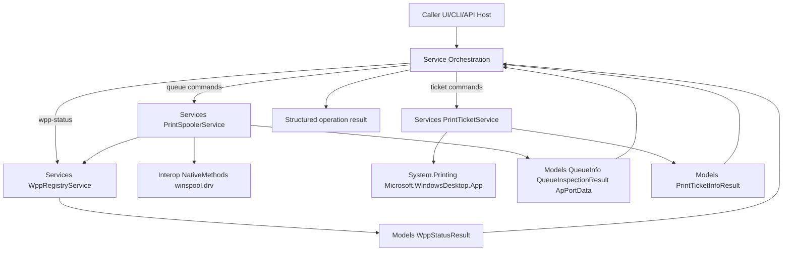
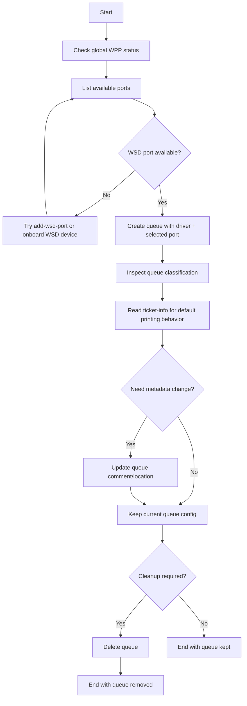
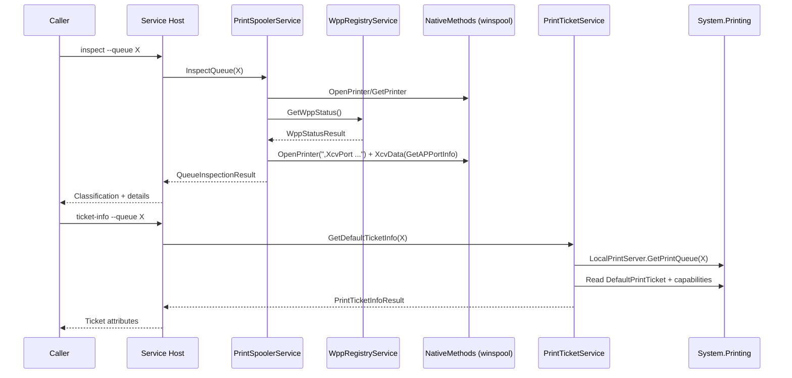
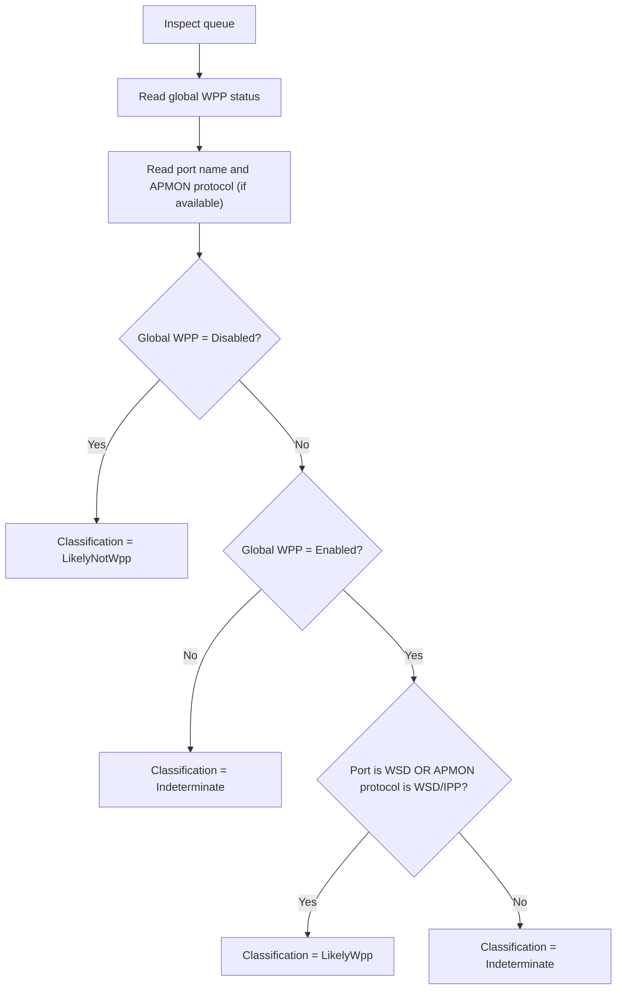

# Architecture Styles for Study

## Why this structure exists
This POC is intentionally organized to show complementary styles in the same project:

1. **Service/API orchestration style (.NET managed layer)**
   - Service contracts in `Abstractions/*`.
   - Execution and use-case orchestration in `Services/*`.
   - Result and request contracts in `Models/*`.
   - Optional UI adapter (`WppQueuePoc.App`) reuses the same service contracts.

2. **Native interop style (Windows Print Spooler)**
   - `Interop/NativeMethods.cs`: raw P/Invoke bindings, structs, constants.
   - `Services/PrintSpoolerService.cs`: safe wrapper around native calls (`OpenPrinter`, `XcvData`, `AddPrinter`, `SetPrinter`, `DeletePrinter`, `EnumPorts`, `EnumPrinters`, `GetPrinter`).
   - `Services/WppRegistryService.cs`: Registry-based WPP state detection.

3. **Managed print ticket style (Windows Desktop printing APIs)**
   - `Services/PrintTicketService.cs`: diagnostics and updates for default/user print tickets via reflection.
   - Requires `Microsoft.WindowsDesktop.App` framework reference at build/runtime.

## How they work together
- The service layer orchestrates behavior and keeps operation UX/API integration simple.
- The interop layer isolates native complexity and Win32 details.
- This separation helps experimentation and troubleshooting without coupling presentation logic to native memory/handle management code.

## Practical benefit in this POC
- Easier to compare and study managed .NET service design versus low-level Windows API integration.
- Easier to extend with advanced scenarios such as:
  - `GetAPPortInfo` diagnostics for APMON/WSD/IPP ports.
  - **Print Ticket** diagnostics and updates (`ticket-info`, `ticket-update-default`, `ticket-update-user`).

## Execution schema (Mermaid)

## Command mapping: caller, executor, objective, result
| Command | Caller | Executor | Objective | Result model/output |
|---|---|---|---|---|
| `wpp-status` | Host/UI | `WppRegistryService` | Detect global WPP state from Registry | `WppStatusResult` (`Enabled/Disabled/Unknown`) |
| `add-wsd-port` | Host/UI | `PrintSpoolerService` -> `NativeMethods.XcvData` | Try creating WSD port in monitor | Success/error (`dwStatus`/Win32) |
| `create` | Host/UI | `PrintSpoolerService` -> `NativeMethods.AddPrinter` | Create queue with chosen driver/port | Queue creation confirmation or Win32 error |
| `list` | Host/UI | `PrintSpoolerService` -> `NativeMethods.EnumPrinters` | List installed queues | `QueueInfo[]` |
| `list-ports` | Host/UI | `PrintSpoolerService` -> `NativeMethods.EnumPorts` | List available ports | `string[]` |
| `list-drivers` | Host/UI | `PrintSpoolerService` -> `NativeMethods.EnumPrinterDrivers` | List installed drivers | `string[]` |
| `list-processors` | Host/UI | `PrintSpoolerService` -> `NativeMethods.EnumPrintProcessors` | List print processors | `string[]` |
| `list-datatypes` | Host/UI | `PrintSpoolerService` -> `NativeMethods.EnumPrintProcessorDatatypes` | List datatypes for a processor | `string[]` |
| `update` | Host/UI | `PrintSpoolerService` -> `NativeMethods.SetPrinterW` | Update queue metadata | Queue update confirmation or Win32 error |
| `delete` | Host/UI | `PrintSpoolerService` -> `NativeMethods.DeletePrinter` | Remove queue | Queue deletion confirmation or Win32 error |
| `inspect` | Host/UI | `PrintSpoolerService` (+ `WppRegistryService`) | Classify queue as likely WPP/not WPP | `QueueInspectionResult` with details |
| `ticket-info` | Host/UI | `PrintTicketService` -> `System.Printing` | Read default and user ticket snapshots | `PrintTicketInfoResult` |
| `ticket-update-default` | Host/UI | `PrintTicketService` -> `System.Printing` | Update default queue print ticket | `PrintTicketUpdateResult` |
| `ticket-update-user` | Host/UI | `PrintTicketService` -> `System.Printing` | Update user print ticket for queue | `PrintTicketUpdateResult` |

## Business process flow (Mermaid)

## Technical sequence flow (Mermaid)

## Classification decision flow (Mermaid)

