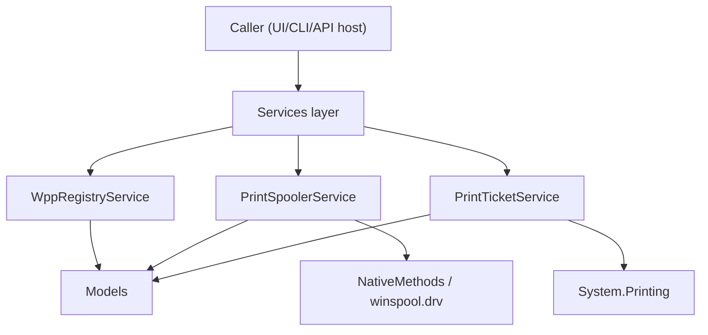

# Architecture Overview (POC)

This POC uses a simple 3-layer design to keep Windows printing operations testable and easy to evolve.

## Layers
- `Services/*`: API/use-case layer (`PrintSpoolerService`, `WppRegistryService`, `PrintTicketService`).
- `Interop/NativeMethods.cs`: Winspool P/Invoke boundary (handles, buffers, native errors).
- `Models/*` + `Abstractions/*`: request/response contracts and service interfaces.

## What each service is responsible for
- `PrintSpoolerService`: queue/port lifecycle and queue inspection.
- `WppRegistryService`: global WPP status from Registry.
- `PrintTicketService`: default/user print ticket read and update via `System.Printing` reflection.

## Supported operation groups
- WPP status: `wpp-status`.
- Queue and spooler: `add-wsd-port`, `create`, `list`, `list-ports`, `list-drivers`, `list-processors`, `list-datatypes`, `update`, `delete`, `inspect`.
- Print ticket: `ticket-info`, `ticket-update-default`, `ticket-update-user`.

## High-level flow

## Why this is enough for the POC
- Keeps native complexity isolated.
- Makes command behavior explicit through typed results.
- Allows changing UI/host without changing core printing logic.
